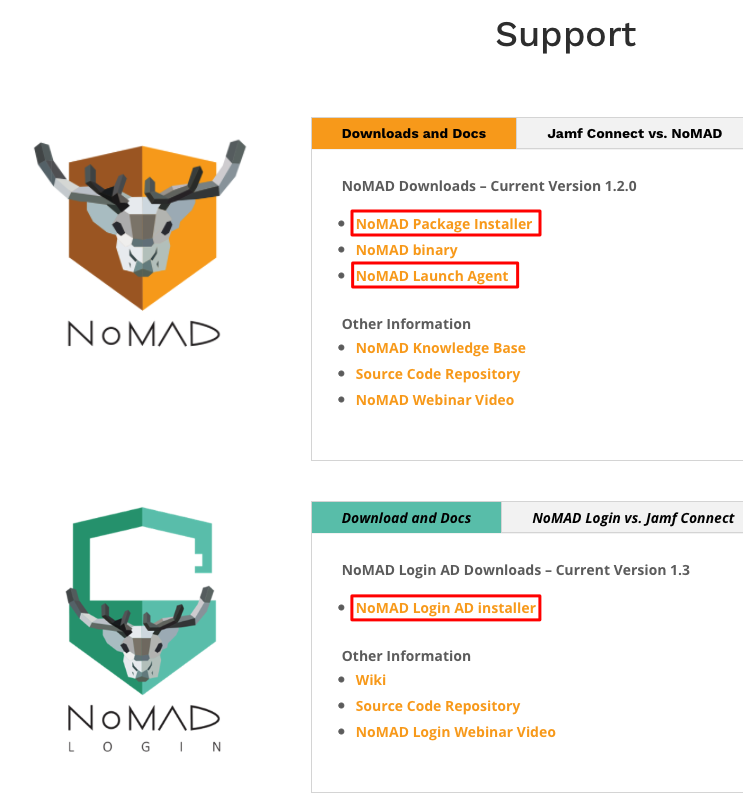
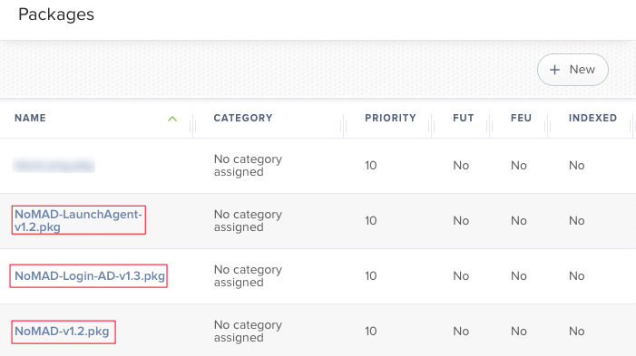
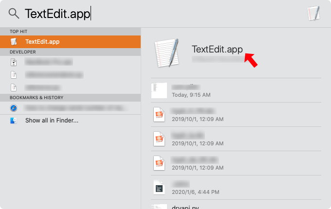
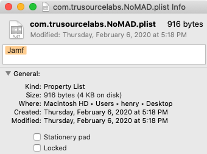

# 用 NoMAD 實現遠端身份識別
---

在一個公司中有完善的電腦管理架構是非常重要的，通常公司中會建立 **Active Directory 網域服務** **(AD DS)** 集中管理，最重要的是 **集中管理帳號密碼** ，因為公司中會有各種服務像是 Exchange 電子郵件、網路磁碟機、印表機等，如果請員工一個服務就申請一個帳號密碼，這樣在 IT 管理上也是非常的不方便。

在 Mac 上要加入網域非常的方便，只要在 MDM 伺服器上自動佈署下去就完成了，在這之前先來了解 Mac 有哪些帳戶種類
1. Local user accounts
2. Network user accounts
3. Mobile user accounts

**Local user accounts** 顧名思義就是本地端的使用者，只要在 Mac 上所建立的使用者都是屬於這個種類，不過這不屬於文章探討範圍
我們來討論比較特別的 Network user accounts 以及 Mobile user accounts

**Network user accounts** 可以在很多台 Mac 上登錄，前提是必須要有 **目錄伺服器**，像是 AD 伺服器才可以，因為在這個使用中所有的資料都是儲存在目錄伺服器，所以在使用的時候一定要確保連線順暢，但是這樣非常的不方便，如果今天無法連線到伺服器那就沒辦法使用了。

**Mobile user accounts** 跟 Network user accounts 非常的像，唯一不同的是檔案直接儲存在本地，這樣就可以順利的解決沒辦法連線到伺服器就無法使用的這個缺點，但是在企業中有非常多的服務，各種服務都必須要在使用者跟 AD 認證後取得 Kerberos tickets 才可以使用，Mobile user accounts無法取得這個認證，而且企業中為了資訊安全會要求員工在一段時間過後必須要重新設定密碼，這就造成了一個問題，重新設定密碼之後在 AD 中密碼已經更新了，但是在電腦中的密碼並沒有更新，macOS 密碼同步的功能是不完整的，這造成企業在管理以及員工使用電腦非常大的麻煩，這時候 NoMAD 就是一個好辦法可以解決這個問題。

## 什麼是 NoMAD

NoMAD 是一款開源軟體，他可以讓 IT管理人員不需要將每台 Mac 加入到網域裡但同時使用所有功能，NoMAD 透過登入 AD 帳戶取得 Kerberos tickets來建立 Mac 的本地端使用者，可以隨時在電腦上變更密碼而不用擔心密碼不同步的問題也可以使用Exchange 電子郵件、網路磁碟機、印表機等功能，最方便的是 NoMAD 可以透過 MDM 自動佈署到 Mac 中而不用一台一台設定，我們就來教大家如何佈署以及使用 NoMAD 。


## NoMAD 佈署

在佈署前請先確認以下條件
1. Active Directory
2. 測試用 Mac (必須使用已登記在 Apple Business Manager 或是 Apple School Manager的 Mac )
3. MDM 伺服器 (使用 Jamf Pro 進行示範)

以上條件缺一不可，都準備完了就可以開始進行部署囉

### 1.到 NoMAD [網站](https://nomad.menu/support/)下載以下軟體
* NoMAD Login AD installer
* NoMAD Package Installer
* NoMAD Launch Agent



1. NoMAD Login AD  讓 Mac 可以替換掉原生的登入頁面並且在登入的時候就可以建立與 AD 的連線。
2. NoMAD  會顯示在狀態列上隨時提醒使用者密碼到期日期，選單中可以點選change Password 來更換密碼，Preferences 中必須要設定與 AD 連線的相關數值，等等教學中會提到。
3. NoMAD Launch Agent 讓使用者在登入時自動打開 NoMAD 並且使用者無法自行關閉。

### 2.設定MDM 伺服器 (使用 Jamf Pro 進行示範)
1. 將下載的三個檔案放入Jamf Pro 中

2. 在 Jamf Pro 中設定 Scripts
這個Script 設定是給NoMAD Login AD所使用，Script的名稱請設定為 **NoMAD Postinstall** ，其中有些設定值請依據實際部署環境設定
```
#!/bin/bash

domain="請輸入網域名稱"
#設定背景圖片
background_image="/Library/Desktop Pictures/Mojave Day.jpg"
#設定背景圖片透明度
background_image_alpha="0"
#設定登入LOGO
logo="/Library/Desktop Pictures/logo/black.png"
#是否將密碼加入Keychain
keychain_add="TRUE"
#是否啟用登入畫面
login_screen="false"

# Set default AD domain
defaults write /Library/Preferences/menu.nomad.login.ad.plist ADDomain "$domain"

# Set background image
defaults write /Library/Preferences/menu.nomad.login.ad.plist BackgroundImage "$background_image"

# Set background image transparency
defaults write /Library/Preferences/menu.nomad.login.ad.plist BackgroundImageAlpha -int "$background_image_alpha"

# Set login window logo
defaults write /Library/Preferences/menu.nomad.login.ad.plist LoginLogo "$logo"

# Enable or disable login screen
defaults write /Library/Preferences/menu.nomad.login.ad.plist LoginScreen -bool "$login_screen"

# Adds a NoMAD entry into the keychain
defaults write /Library/Preferences/menu.nomad.login.ad.plist KeychainAddNoMAD -bool "$keychain_add"

# Should NoLo create a Keychain if none exists
defaults write /Library/Preferences/menu.nomad.login.ad.plist KeychainCreate -bool "$keychain_add"


# Set security authorization database mechanisms with authchanger
/usr/local/bin/authchanger -reset -AD

# Kill loginwindow process to force NoMAD Login to launch
/usr/bin/killall -HUP loginwindow

exit 0
```
3. 建立 Smart Computer Groups
這邊選用 Smart Computer Groups 而不使用 Static Computer Groups 是因為電腦還沒有登記到 Jamf Pro 時在 Static Computer Groups 是不會出現的，必須要使用 Smart Computer Groups 等等才能把 NoMAD 的設定指定到 Mac 裡。
4. 建立 Policies
* 在 Trigger 中選擇 Enrollment Complete

* Packages 新增剛才所下載的三個安裝檔

* Scripts 新增NoMAD Postinstall

* Scope 新增要佈署 NoMAD 的 Smart Computer Groups


5. 建立 Configuration Profiles
在 Configuration Profiles 中可以使用 Custom Settings 來設定 NoMAD 應用程式的偏好設定。
* 在PREFERENCE DOMAIN 中輸入 `com.trusourcelabs.NoMAD`

* 在 macOS 上打開 TextEdit.app

* 在 Format 中點選 Make Plain Text 才不會有格式問題

* 輸入以下程式碼，在ADDomain以及KerberosRealm的設定值請依據實際部署環境設定
```
<?xml version="1.0" encoding="UTF-8"?>
<!DOCTYPE plist PUBLIC "-//Apple//DTD PLIST 1.0//EN" "http://www.apple.com/DTDs/PropertyList-1.0.dtd">
<plist version="1.0">
<dict>
		<key>ADDomain</key>
		<string>yourdomain.com.tw</string>
		<key>KerberosRealm</key>
		<string>YOURDOMAIN.COM.TW</string>
		<key>RenewTickets</key>
		<string>1</string>
		<key>SecondsToRenew</key>
		<string>7200</string>
		<key>ShowHome</key>
		<string>0</string>
		<key>UseKeychain</key>
		<string>1</string>
		<key>LocalPasswordSync</key>
		<string>1</string>
		<key>SignInWindowOnLaunch</key>
		<string>1</string>
</dict>
</plist>
```
這裡面所包含的設定值只是最基礎的設定，更進階的設定值在[ NoMAD 網站](https://nomad.menu/help/preferences-and-what-they-do/)可以看到。
* 存檔為 Plist 檔案，檔案名稱為 **com.trusourcelabs.NoMAD.plist**

* 點選 Upload PLIST File 把剛才建立的 plist 檔案上傳到 Jamf Profiles

* 在 Scope 選擇要佈署 NoMAD 的 Smart Computer Groups


6. 建立 PreStage Enrollments
PreStage Enrollments 的設定在 裝置註冊計劃 (DEP)  非常重要，Mac 在啟用流程向 Apple 註冊後會依照PreStage Enrollments來幫助在範圍內的 Mac 做相同的設定。
* 新增 PreStage Enrollments

* Accounts Settings 中的 Local User Account Type 請設定為 **Skip Account Creation** 因為等等 NoMAD 在連線到 AD 之後會直接建立一個本地使用者。

* Scope 中會出現所有已經綁定到Apple Business Manager 或是 Apple School Manager 並且已經指派到 Jamf Pro 中的 Mac 選擇後點選 Save


### NoMAD 實際佈署畫面
