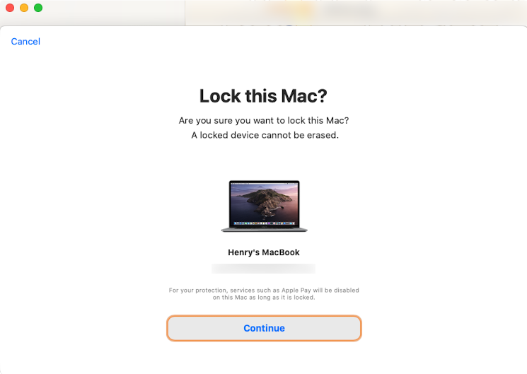

# 啟用鎖定
---

macOS Catalina 支援了一項重要的安全性設定，**啟用鎖定** ，在您的 Mac 遺失時可使用 **尋找(Find My)** 遠端鎖定您的 Mac 讓未經授權的人員無法使用您的 Mac

#### 若要開啟啟用鎖定 Mac 必須符合以下條件

1. Mac 必須升級到 macOS Catalina
2. Mac 必須要有 T2 晶片
3. 您的 Apple ID 必須開啟 雙重認證
4. 您的 Mac 不允許從外部裝置開機

只要有打開 **尋找我的 Mac**，並且符合上述條件，啟用鎖定就會自動開啟。
#### 如何快速知道自己的 Mac 是否開啟啟用鎖定 ?

1. 點選左上角 
2. 點選『關於這台 Mac』
3. 點選『系統報告』
4. 有支援啟用鎖定的 Mac 在最下方會出現 啟用鎖定狀態：已啟用

#### 如果您的 Mac 遺失，該怎麼辦？

1. 打開 『尋找(Find My)』

2. 點選您所遺失的 Mac

3. 在標記為遺失中點選『啟用』

4. 確定 Mac 資訊

5. 設定密碼

6. 輸入訊息，此訊息會顯示在遺失中的 Mac 上
